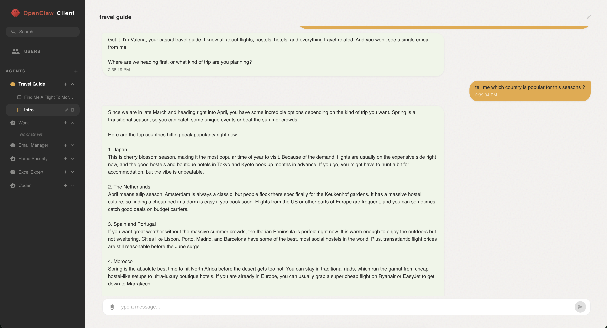

# OpenClaw Client

A web-based chat interface for [OpenClaw](https://openclaw.ai) AI agents. Create multiple agents, manage conversations, upload files, and stream AI responses in real time — all through a clean, modern UI.



## Features

- **Multi-agent support** — Create and manage multiple OpenClaw agents, each with their own identity and conversation history.
- **Streaming chat** — Real-time streamed responses with separate display for thinking process and output.
- **File uploads** — Attach files to messages; files are saved directly to the agent's workspace for context-aware responses.
- **Conversation management** — Multiple conversations per agent, editable titles, searchable sidebar.
- **User authentication** — JWT-based auth with a default admin account created on first run.

## Architecture

```
┌─── Docker ─────────────────────────────┐
│  Client (React)       → localhost:18800│
│  API (Express/Node)   → localhost:18802│
│  MongoDB              → localhost:27017│
└─────────────────────────┬──────────────┘
                          │
              ┌───────────▼───────────┐
              │  Proxy (host:18801)   │
              │  spawns openclaw CLI  │
              └───────────────────────┘
```

- **Client** — React 19 + Vite + Material UI + Redux Toolkit Query
- **API** — Express + TypeScript + Mongoose
- **MongoDB** — Data store for users, agents, conversations, and messages
- **Proxy** — Lightweight Express server that runs on the host and executes OpenClaw CLI commands

The proxy runs on the host (not in Docker) so it can access the locally installed OpenClaw CLI and your `~/.openclaw` configuration.

## Prerequisites

- [Docker](https://docs.docker.com/get-docker/) and Docker Compose
- [Node.js](https://nodejs.org/) 18+ (for the proxy)
- [OpenClaw CLI](https://openclaw.ai) installed and authenticated on your machine

Verify OpenClaw is set up:

```bash
openclaw --version
openclaw auth status
```

## Quick Start

```bash
# Clone the repository
git clone <repo-url>
cd openclaw

# Make scripts executable
chmod +x start.sh stop.sh

# Start everything
./start.sh
```

The start script will:

1. Generate environment files (`.env`, `api/.env`) with random secrets on first run
2. Install proxy dependencies
3. Start Docker containers (client, API, MongoDB)
4. Start the OpenClaw proxy on the host

Once running:

| Service  | URL                        |
|----------|----------------------------|
| Client   | http://localhost:18800     |
| API      | http://localhost:18802     |
| API Docs | http://localhost:18802/api/docs |
| Proxy    | http://localhost:18801     |

## Default Login

On first startup, a default admin user is created:

- **Email:** `admin@admin.com`
- **Password:** `123456`

## Stopping

```bash
./stop.sh
```

This stops all Docker containers and kills the proxy process.

## Configuration

### Environment Variables

Generated automatically by `start.sh` on first run:

**`api/.env`**
| Variable     | Description                          |
|--------------|--------------------------------------|
| `NODE_ENV`   | Environment mode (`development`)     |
| `JWT_SECRET` | Random secret for JWT signing        |
| `MONGO_LINK` | MongoDB connection string with auth  |

**`.env`** (project root — used by Docker Compose)
| Variable         | Description              |
|------------------|--------------------------|
| `MONGO_USER`     | MongoDB root username    |
| `MONGO_PASSWORD` | MongoDB root password    |

### Proxy Environment Variables

Optional — set before running `proxy.js`:

| Variable        | Default                    | Description                     |
|-----------------|----------------------------|---------------------------------|
| `PROXY_PORT`    | `18801`                    | Port the proxy listens on       |
| `OPENCLAW_HOME` | `~/.openclaw`              | Path to OpenClaw config directory |

